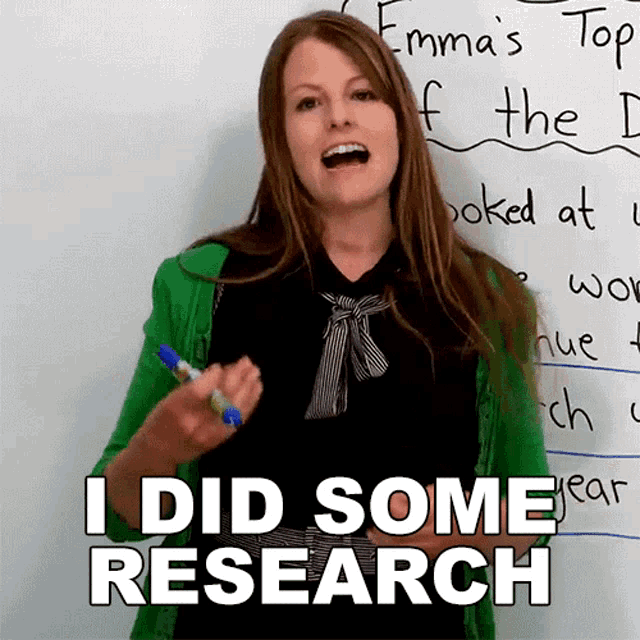
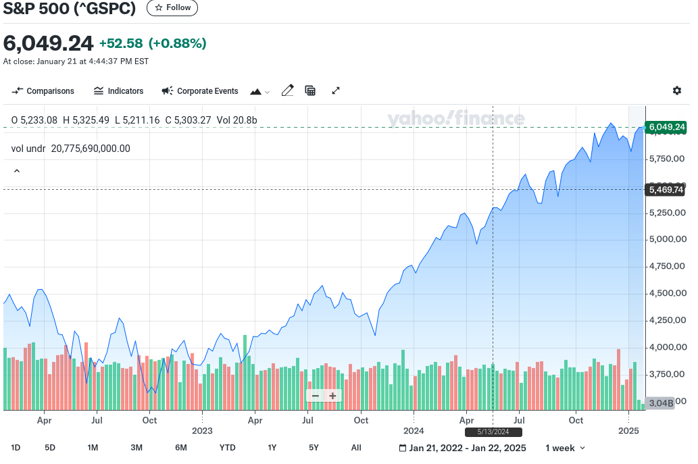
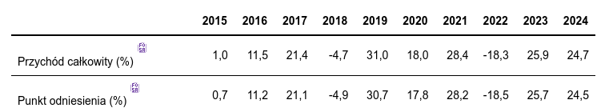
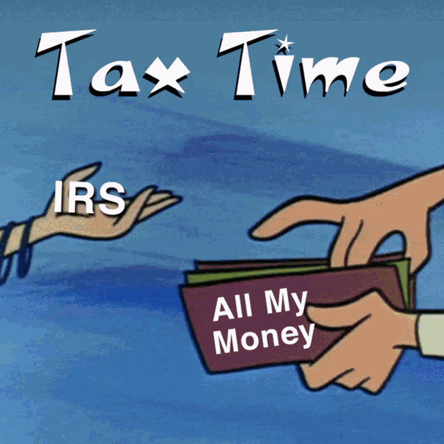

---
title:
- Jak kupić pierwszy ETF?
author:
- Marek Gawryszewski
date:
- 2024.01.24
---

# Wstępniak

---

## Zasady

* Prezentacja: ~20-30 min
* Q&A: 30+ min
* W trakcie prezentacji, pytania zadajemy na czacie - odpowiem na nie w pierwszej kolejności.

## Sprawdź zanim zaczniesz

::: columns
:::: {.column width=70%}
Nie jestem profesjonalnym doradcą inwestycyjnym.

Zanim podejmiesz decyzję, sprawdź!

::::
:::: {.column width=30%}

<small>[source](https://tenor.com/pl/view/i-did-some-research-emma-learn-english-with-emma-i-research-for-it-i-did-a-study-gif-22184801)</small>

::::
:::

---

## Ta prezentacja to...

<i>Wstęp do omówienia abstraktu spisu treści skrótu opracowania.</i>

# Rozgrzewka

Pytanie rozgrzewkowe:
podnieś rękę jeśli...

## Inwestujesz na giełdzie?

## Wiesz co to jest ETF?

## Rozważasz zakup ETF?

# Co to jest ETF ?

    Exchange Traded Fund, czyli fundusz notowany na giełdzie.

    ETF to fundusz replikujący cenę wybranych aktywów.

## Dla kogo?

* perspektywa: długoterminowa 10-15+ lat
* skłonność do ryzyka: niska/średnia
* sposób inwestowania: stałe kwoty np. raz na kwartał
* dywersyfikacja: szeroki rynek
* wiedza o inwestowaniu: niska-średnia
* znajomość rynku: niska-średnia

## Dlaczego fundusze ETF są popularne?

* Ekspozycja na szeroki rynek
* Bardzo duży wybór funduszy i śledzonych papierów wartościowych/towarów
* Zmniejszone ryzyko niż pojedyncze aukcje
* Dywersyfikacja
* Niskie koszty

---

## Jak działają ETF?

Fundusz ETF naśladuje aktywa w które inwestuje.

::: columns
:::: {.column width=50%}

<small>[source](https://atlasetf.pl/etf-details/IE00B5BMR087)</small>
::::
:::: {.column width=50%}

<small>[source](https://finance.yahoo.com/quote/%5EGSPC/chart/#eyJsYXlvdXQiOnsiaW50ZXJ2YWwiOiJ3ZWVrIiwicGVyaW9kaWNpdHkiOjEsInRpbWVVbml0IjpudWxsLCJjYW5kbGVXaWR0aCI6Ni4wMTI2NTgyMjc4NDgxMDEsImZsaXBwZWQiOmZhbHNlLCJ2b2x1bWVVbmRlcmxheSI6dHJ1ZSwiYWRqIjp0cnVlLCJjcm9zc2hhaXIiOnRydWUsImNoYXJ0VHlwZSI6Im1vdW50YWluIiwiZXh0ZW5kZWQiOmZhbHNlLCJtYXJrZXRTZXNzaW9ucyI6e30sImFnZ3JlZ2F0aW9uVHlwZSI6Im9obGMiLCJjaGFydFNjYWxlIjoibGluZWFyIiwic3R1ZGllcyI6eyJ2b2wgdW5kciI6eyJ0eXBlIjoidm9sIHVuZHIiLCJpbnB1dHMiOnsiU2VyaWVzIjoic2VyaWVzIiwiZGlzcGxheSI6InZvbCB1bmRyIn0sIm91dHB1dHMiOnsiVXAgVm9sdW1lIjoiIzBkYmQ2ZWVlIiwiRG93biBWb2x1bWUiOiIjZmY1NTQ3ZWUifSwicGFuZWwiOiJjaGFydCIsInBhcmFtZXRlcnMiOnsiY2hhcnROYW1lIjoiY2hhcnQiLCJlZGl0TW9kZSI6dHJ1ZSwicGFuZWxOYW1lIjoiY2hhcnQifSwiZGlzYWJsZWQiOmZhbHNlfX0sInBhbmVscyI6eyJjaGFydCI6eyJwZXJjZW50IjoxLCJkaXNwbGF5IjoiXkdTUEMiLCJjaGFydE5hbWUiOiJjaGFydCIsImluZGV4IjowLCJ5QXhpcyI6eyJuYW1lIjoiY2hhcnQiLCJwb3NpdGlvbiI6bnVsbH0sInlheGlzTEhTIjpbXSwieWF4aXNSSFMiOlsiY2hhcnQiLCLigIx2b2wgdW5kcuKAjCJdfX0sIm91dGxpZXJzIjpmYWxzZSwiYW5pbWF0aW9uIjp0cnVlLCJoZWFkc1VwIjp7InN0YXRpYyI6dHJ1ZSwiZHluYW1pYyI6ZmFsc2UsImZsb2F0aW5nIjpmYWxzZX0sImxpbmVXaWR0aCI6MiwiZnVsbFNjcmVlbiI6dHJ1ZSwic3RyaXBlZEJhY2tncm91bmQiOnRydWUsImNvbG9yIjoiIzAwODFmMiIsImNyb3NzaGFpclN0aWNreSI6ZmFsc2UsInN5bWJvbHMiOlt7InN5bWJvbCI6Il5HU1BDIiwic3ltYm9sT2JqZWN0Ijp7InN5bWJvbCI6Il5HU1BDIiwicXVvdGVUeXBlIjoiSU5ERVgiLCJleGNoYW5nZVRpbWVab25lIjoiQW1lcmljYS9OZXdfWW9yayIsInBlcmlvZDEiOjE0OTExNzA0MDAsInBlcmlvZDIiOjE3Mzc1NTgwMDB9LCJwZXJpb2RpY2l0eSI6MSwiaW50ZXJ2YWwiOiJ3ZWVrIiwidGltZVVuaXQiOm51bGx9XSwicmFuZ2UiOnsiZHRMZWZ0IjoiMjAyMi0wMS0yMVQyMzowMDowMC4wMDBaIiwiZHRSaWdodCI6IjIwMjUtMDEtMjJUMjI6NTk6MDAuMDAwWiIsInBhZGRpbmciOjB9fSwiZXZlbnRzIjp7ImRpdnMiOnRydWUsInNwbGl0cyI6dHJ1ZSwidHJhZGluZ0hvcml6b24iOiJub25lIiwic2lnRGV2RXZlbnRzIjpbXX0sInByZWZlcmVuY2VzIjp7ImN1cnJlbnRQcmljZUxpbmUiOnRydWUsImRpc3BsYXlDcm9zc2hhaXJzV2l0aERyYXdpbmdUb29sIjpmYWxzZSwiZHJhd2luZ3MiOm51bGwsImhpZ2hsaWdodHNSYWRpdXMiOjEwLCJoaWdobGlnaHRzVGFwUmFkaXVzIjozMCwibWFnbmV0IjpmYWxzZSwiaG9yaXpvbnRhbENyb3NzaGFpckZpZWxkIjpudWxsLCJsYWJlbHMiOnRydWUsImxhbmd1YWdlIjpudWxsLCJ0aW1lWm9uZSI6IkFtZXJpY2EvTmV3X1lvcmsiLCJ3aGl0ZXNwYWNlIjo1MCwiem9vbUluU3BlZWQiOm51bGwsInpvb21PdXRTcGVlZCI6bnVsbCwiem9vbUF0Q3VycmVudE1vdXNlUG9zaXRpb24iOmZhbHNlfX0-)</small>

::::
:::

---

## Co może śledzić ETF?

* indeksy giełdowe
* surowce
* tematy np. półprzewodniki

---

## Czy ETF może tracić?

<small>[source](https://www.blackrock.com/pl/inwestorzy-indywidualni/produkty/253743/ishares-sp-500-b-ucits-etf-acc-fund)</small>

# Jak wybrać ETF?

---

## Parametry

* Śledzone zasoby
* Całkowite koszty (TER)
* Waluta
* Siedziba funduszu
* Replikacja
* Dywidendy
* Wielkość

## Replikacja

* Fizyczna: powiązane zasoby są faktycznie kupowane
* Systetyczna: kupowany jest kontrakt (swap) zamiast zasobu

---

## Dywidenda

* Akumulacyjne: dywidenda jest reinwestowana
* Dystrybucyjne: dywidenda jest wypłacana

# Gdzie kupić?

---

## Brokerzy

* (chyba?) wszystkie domy maklerskie
* XTB
* Degiro, Interactive Brokers, ...
* eToro, Trade212, ...

Różni brokerzy mają różną ofertę!

---

## Waluta

* PLN
* EUR/USD/GPB z przewalutowaniem
* EUR/USD/GPB

Wybór waluty to przede wszystkim warunki zakupu u borkera a nie wynik ETF.

# Podatki

::: columns
:::: {.column width=50%}
PIT-38!

::::
:::: {.column width=50%}

<small>[source](https://tenor.com/pl/view/irs-tax-time-all-my-money-gif-17739954)</small>

::::
:::

# Q&A

# Jak szukać ETF?

iShares Core S&P 500 UCITS ETF USD (Acc)

* [Atlas ETF](https://atlasetf.pl/etf-details/IE00B5BMR087)
* [Just ETF](https://www.justetf.com/en/etf-profile.html?isin=IE00B5BMR087#overview)
* [Backtest](https://curvo.eu/backtest/pl/portfel/ishares-core-s-p-500-ucits-etf-acc--NoIglgygFghgTgUwM4AIDCB7RKIDIAKKArAAwkoCqaAkgCoQoCitAYigBQCCAxtwJQgANMFDVGZAEJEJAWQBKJABwB2IQEYAulqA)